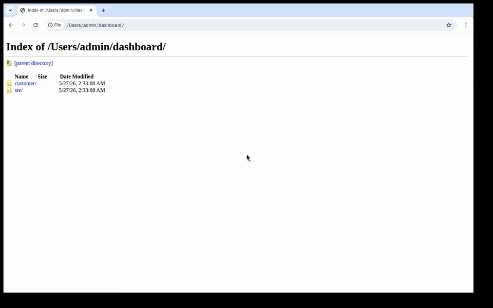

# grafview

View Grafana dashboard JSONs with simulated data without configuring data sources.

[](demo/out/grafview-demo.mp4)

This is useful when needing to preview/demo dashboards without having access to the environment/data the dashboard expects.

## Install

```bash
go install github.com/RohanAdwankar/grafview/cmd/grafview@latest
```

## Usage

```bash
grafview /path/to/dashboard.json
grafview /path/to/dashboards
```

When the input is a directory, the tool recursively finds Grafana JSON files,
sanitizes runtime copies into a temporary directory, provisions mock
Prometheus/Loki datasources, starts Grafana in Docker, and opens the dashboard
or dashboard browser.

Dashboard folders mirror each JSON file's relative directory under the input
root. For example, `external/summary/a.json` becomes the Grafana folder
`external / summary`.

Flags:

```text
-port        Grafana host port; 0 chooses a free port
-mock-port   mock datasource host port; 0 chooses a free port
-image       Grafana Docker image
-name        Docker container name
-open        open the local Grafana URL
-keep        keep the Docker container and temp runtime files on exit
```
